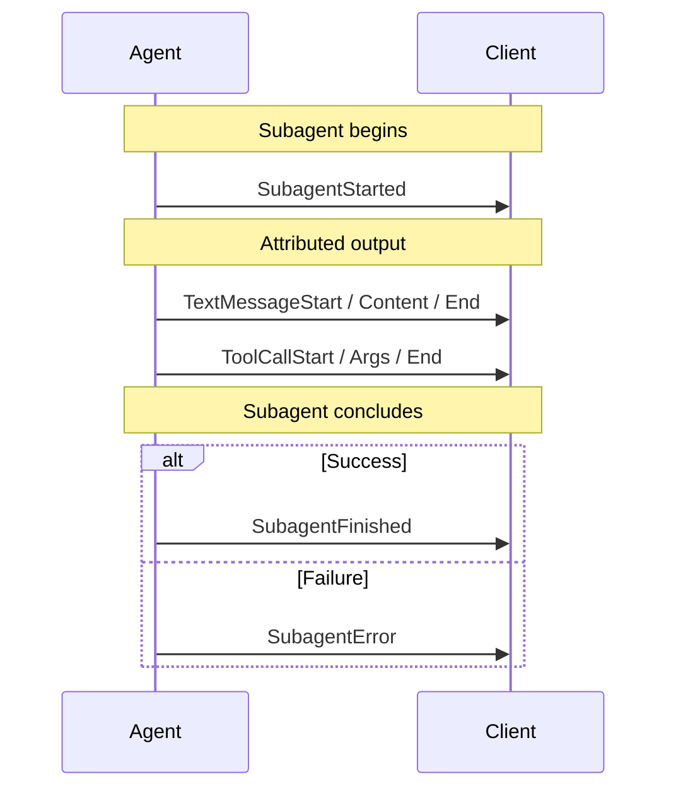

# Subagents

Many agent frameworks let an agent delegate work to child agents — a supervisor
dispatching research tasks, an agents-as-tools pattern where a tool call *is* a
nested agent, or a planner farming out subtasks in parallel.

To a frontend, all of that arrives as one event stream. Without extra
information there is no way to tell which subagent produced a given message, so
three concurrent researchers render as one undifferentiated wall of text.

AG-UI's subagent support solves exactly that problem and nothing more: it
**attributes** each event to the subagent that produced it, and reports when
subagents start and stop. It does not orchestrate, schedule, or define
subagents — that stays entirely with the framework.

## `subagentRunId` identifies an invocation, not a definition

This is the single most important thing to understand, and the easiest thing to
get wrong.

`subagentRunId` is an **opaque handle for one invocation** of a subagent. Run the
same subagent twice and you get two different values. It is not a stable
identifier for a reusable subagent definition, and it is not a name.

The symmetry with the top-level run makes the distinction clearer:

| Top level                            | Subagent                                       |
| ------------------------------------ | ---------------------------------------------- |
| `agentId` — a configured, reusable agent | the subagent's `name` — a reusable subagent type |
| `runId` — one invocation's lifecycle | `subagentRunId` — one nested invocation's lifecycle |

So:

- **Do** key transient UI state — a collapsible group, a spinner, a progress row —
  by `subagentRunId`.
- **Do not** persist anything by `subagentRunId` expecting it to be meaningful on
  a later run, and do not treat two invocations of one subagent as sharing a
  value. Use `name` when you mean "which kind of subagent this is".
- **One exception**: a subagent that finished with `outcome: { type: "suspended" }`
  **may** reuse its id on a resuming run. Producers that can correlate the
  resumed work with the suspended invocation should do so, and a client must
  treat that later `SubagentStarted` as a continuation (waiting → running),
  never as a duplicate. A producer that cannot correlate mints a new id — the
  client's waiting state then resolves through the interrupt ids it answered,
  not through id reuse (see [Suspension](#suspension)).

<Note>
  This field was called `subagentId` in prerelease builds. It was renamed because
  the old name implied a reusable definition. If you are on a `canary` build that
  still uses `subagentId`, the value has the same meaning — only the name changed.
</Note>

## Lifecycle events

Three events bracket a subagent's activity.



### SubagentStarted

Announces a new subagent invocation and gives it a name a UI can display.

| Property              | Description                                                     |
| --------------------- | --------------------------------------------------------------- |
| `subagentRunId`       | Opaque id for this invocation. Required                          |
| `name`                | The subagent's declared type or name, for display. Required      |
| `description`         | Optional human-readable description                             |
| `parentSubagentRunId` | Optional — the enclosing subagent, when subagents nest           |
| `parentToolCallId`    | Optional — the tool call that spawned this subagent              |
| `parentMessageId`     | Optional — the message that held that tool call                  |

`parentToolCallId` and `parentMessageId` exist for the agents-as-tools pattern.
They let a client correlate a subagent to the call that created it — to render
the subagent's output inside the tool-call card, for instance — without having to
inspect `rawEvent`.

### SubagentFinished

Closes a subagent invocation's stream segment for this run.

| Property        | Description                                             |
| --------------- | ------------------------------------------------------- |
| `subagentRunId` | Matches the id from `SubagentStarted`. Required          |
| `result`        | Optional completion payload, mirroring `RunFinished.result` |
| `outcome`       | Optional typed outcome, mirroring `RunFinished.outcome`: `{ type: "success" }` or `{ type: "suspended", interruptIds?: [...] }`. Omitted means success |

#### Suspension

A subagent can pause mid-task waiting for outside input — a human approval
raised inside it, say. The run then ends with an interrupt outcome (see
[Interrupts](/concepts/interrupts)), and because every started subagent closes
before `RunFinished`, the paused subagent still emits `SubagentFinished` — but
with `outcome: { type: "suspended" }`, so a UI can render "waiting" instead of
"done". `interruptIds` names the run-level interrupts this subagent directly
owns (each such `Interrupt` also carries `subagentRunId` back-reference); it
may be empty or omitted for an ancestor suspended because a *descendant*
interrupted.

Suspension is the one case where a `subagentRunId` may deliberately span
runs — with different obligations on each side:

- **Clients must accept** a later run's `SubagentStarted` that reuses a
  suspended invocation's id, and treat it as a *continuation* — transition the
  existing group from waiting back to running, never render a duplicate.
- **Producers should reuse the id when they can** correlate the resumed work
  with the suspended invocation. The LangGraph integration does: its ids
  derive from checkpoint task identity, which survives the pause. Reuse is
  what lets a client continue the group seamlessly.
- **Producers that cannot correlate mint a new id**, and that is valid. The
  client's waiting state does not dangle: the suspended outcome's
  `interruptIds` and the resume entries the client itself sent identify which
  approvals were answered, so the waiting badge resolves on that basis even if
  no continuation arrives under the old id.

### SubagentError

Marks a subagent invocation as failed.

| Property        | Description                                    |
| --------------- | ---------------------------------------------- |
| `subagentRunId` | Matches the id from `SubagentStarted`. Required |
| `message`       | Human-readable error message. Required         |
| `code`          | Optional error code                            |

## Attribution

Beyond the lifecycle events, most events can carry an optional `subagentRunId`
saying who produced them.

An event with no `subagentRunId` belongs to the parent agent. Attribution is
additive: a stream that never sets the field behaves exactly as it did before
subagents existed.

Attribution also stands on its own. A producer may tag events without ever
emitting `SubagentStarted` / `SubagentFinished` — enough for a UI to group output
by producer, without committing to reporting lifecycle. Clients must accept an
identifier they have never seen announced; see
[Rules clients enforce](#rules-clients-enforce).

**Events that can carry attribution:** the text message family, the tool call
family, activity events, the reasoning family, step events, state events, and
`Raw`/`Custom`.

**Events that cannot:** `RunStarted`, `RunFinished`, `RunError` — these describe
the run as a whole — and `MessagesSnapshot`, which carries attribution
per-message instead, since one snapshot mixes messages from several producers.

### Attribution is provenance, not ownership

This distinction matters most on state events, so it is worth stating plainly.

`StateSnapshot` and `StateDelta` are attributable. Attribution on them records
**which subagent produced the update** — it does not mean the subagent has state
of its own. AG-UI state is run-scoped: there is one state document for the run,
and an attributed snapshot or delta is still applied to that one document. The
tag is provenance you can surface ("the researcher updated the shared
scratchpad"), not a separate scope.

That is exactly the meaning attribution carries on the other standalone events.
Nobody reads an attributed `Custom` event as the subagent having private custom
events, and state is no different.

<Warning>
  There is no such thing as per-subagent state. If you attribute a snapshot
  expecting the parent's state to be left alone, it will not be — the snapshot
  replaces the run's state as any snapshot does. Use a distinct key inside the
  run state if you need to keep subagents' data apart.
</Warning>

Note that a producer is never *obliged* to attribute state. Some do not: the
LangGraph integration, for instance, does not emit state while a subagent is
active, because its state is one shared document and a mid-delegation snapshot
would carry a partial view. That is a reasonable producer-side choice, not a
protocol requirement.

### Attribution transfers to messages

When an attributed event creates a message, the `subagentRunId` transfers onto
that message. This is what lets a rendering layer group a conversation by
subagent without replaying the event stream — the messages themselves carry
their origin, and they keep it across turns and snapshots.

### Tool results carry their own attribution

`ToolCallResult` is attributed independently of the call it answers, and that is
intentional rather than an oversight: the party that *executes* a tool call can
differ from the subagent that *requested* it. A frontend-executed tool, or a
supervisor running a call on a subagent's behalf, both produce a result whose
owner is not the caller. Inheriting the caller's attribution would misreport
those cases, so each result states its own.

## Nesting and concurrency

Subagents nest. `parentSubagentRunId` on `SubagentStarted` links a child to its
enclosing subagent; a subagent with no parent link belongs directly to the run.

Subagents also run **concurrently**, and this is the case that separates a
working implementation from a plausible one. When three subagents stream at once,
their events interleave, and attribution is the only thing that disambiguates
them. In particular:

- Two subagents may have open text messages simultaneously. A client must track
  each independently rather than assuming one open message at a time.
- A subagent's `SubagentFinished` closes only that subagent's own open streams,
  never a sibling's or the parent's.
- A parent may finish before its child. `parentSubagentRunId` may therefore name
  a subagent that has already finished, which is valid.

### Concurrency and the chunk shorthand

The `TextMessageChunk` / `ToolCallChunk` / `ReasoningMessageChunk` events are a
shorthand: a client synthesizes the START/CONTENT/END boundaries, and a chunk
that omits its id means "the same as the previous one". Under concurrency,
"previous" is only meaningful **per subagent** — so the shorthand resolves it
within the sending subagent's own stream, not across the run.

The practical consequence is one rule for producers: a chunk that carries neither
an id nor a `subagentRunId` is resolved to the parent's open stream of that kind
if there is one — untagged means the parent — and otherwise to the sole open
stream of that kind. When several subagents' streams could all claim it, there is
nothing to resolve it against, and the client rejects it rather than guessing.
**When streaming concurrently, attribute every chunk**, or repeat the id.

## Rules clients enforce

Every rule below is *conditional on the events being present*. Attribution alone
is a complete, valid use of subagent support, so nothing here requires a stream
to send lifecycle events at all.

- `SubagentFinished` and `SubagentError` name a subagent that is currently
  active, and a subagent is not started twice within a run. The lifecycle
  events carry their schema-required fields (`subagentRunId` on all three,
  `name` on `SubagentStarted`, `message` on `SubagentError`) — clients enforce
  this even for in-process producers that bypass wire-level schema validation.
- Continuation and close events agree with the owner their entity was created
  under. A text message opened by one subagent cannot be continued by another.
- Ownership is also established by replayed history: a message in a
  `MessagesSnapshot` (and each tool call it carries) is owned by the
  `subagentRunId` it carries — absent means the parent — and a later event
  reopening that id under a different owner is rejected, exactly as a
  conflicting second opener is.
- A tool call belongs to the assistant message its `parentMessageId` names.
  `ToolCall` itself carries no attribution field, so a `ToolCallStart` whose
  explicit `subagentRunId` disagrees with that message's owner cannot be
  represented faithfully and is rejected; an untagged tool call inherits the
  parent message's owner.
- Steps are scoped to the agent that opened them: a subagent cannot close the
  parent's step, or a sibling's.
- Every started subagent is closed before `RunFinished`.

Several things are deliberately **not** enforced, because the protocol does not
require them:

- **A `subagentRunId` used for attribution need not have been started.**
  Attribution without lifecycle events is a supported mode, so a client must not
  treat an unannounced identifier as an error. UIs should group by whatever ids
  they see and fall back to the id when they have no `name`.
- `parentSubagentRunId` need only name a subagent that has been *started*, not
  one still active — a parent legitimately finishes before its child.
- Events attributed to an already-finished subagent are accepted. Continuation
  events carry the tag of the subagent they belong to even after it finishes.
- Closure is required before `RunFinished` only, not before `RunError`. An
  unclosed subagent is the expected shape of an aborted run.
- Attributed state events are accepted. A producer choosing not to emit them
  mid-delegation is a producer-side decision, not a rule — see
  [Attribution is provenance, not ownership](#attribution-is-provenance-not-ownership).

## Compatibility

<Warning>
  **Older clients reject the lifecycle events outright.** Attribution is additive
  and safe — `subagentRunId` is an unknown *field*, which clients tolerate — but
  `SubagentStarted`, `SubagentFinished`, and `SubagentError` are unknown *event
  types*, and a client older than subagent support fails on them while decoding,
  before any application code runs. There is no way to filter them out
  client-side.

  If some of your consumers predate subagent support, the producer must not emit
  the lifecycle events to them.
</Warning>

The two directions are not symmetric, so they are worth separating.

### A new agent talking to an older client

The lifecycle events break it, so emitting them has to be **opt-in on the
producer**. Integrations that support subagents therefore expose a flag to enable
them, off by default — in the LangGraph integration it is `subagent_visibility`:

```python
agent = LangGraphAgent(
    name="my-agent",
    graph=graph,
    subagent_visibility="attributed",
)
```

The value names what the client sees. `"inline"` (the default) emits no
lifecycle events and no `subagentRunId`, and nothing subagent-related reaches
`MessagesSnapshot` — the stream is exactly what it was before subagent support
existed, including the subagent's own text arriving as the parent's work.
`"attributed"` emits the full surface described in this document. `"hidden"`
suppresses the subagent's internal stream entirely: the client sees only the
parent's spawning tool call, its result, and the parent's own reply. Turn on
`"attributed"` once every consumer is new enough.

Attribution alone is the safer intermediate step, since the field is ignored by
clients that do not know it. A producer that wants grouping without a
compatibility break can attribute events and skip the lifecycle entirely.

### A new client talking to an older agent

Handled automatically. The TypeScript client inserts a compatibility shim based
on the agent's reported version, and it acts in **both** directions.

- **Client → agent.** The shim strips `subagentRunId` from the outgoing input
  messages, so an older agent never receives attribution it cannot interpret.
  This is the load-bearing half: a replayed message history, or a stored thread
  written by a newer client, really can carry the field.
- **Agent → client.** The shim also drops `SubagentStarted`, `SubagentFinished`
  and `SubagentError`, and strips `subagentRunId` from every remaining event
  (including `MessagesSnapshot` messages and the `RunStarted` input echo). This is
  defensive normalization rather than translation — an agent that reports a
  pre-subagent version should not be emitting either of those in the first place,
  so what it really guards is a mixed or proxied pipeline.

The consequence of the second direction is worth knowing: a consumer sitting
behind this shim sees a **flattened, unattributed stream**, even if something
upstream did attribute it. If you want attribution to reach your UI, the agent has
to report a version that supports subagents.

## Support

| SDK        | Status                                                       |
| ---------- | ------------------------------------------------------------ |
| TypeScript | Events, attribution, verification, subscriber hooks, protobuf |
| Python     | Events and attribution                                       |
| .NET       | Events, attribution, verification, protobuf                  |

The binary protobuf transport carries subagent attribution on both TypeScript
and .NET, generated from the same schema, so a subagent-attributed stream
survives a round trip across languages.

### Known limitations

- **Protobuf covers a subset of event types.** 19 of the 36 event types have a
  protobuf mapping: all three subagent events, plus the text message, tool call
  start/args/end, state, step and run families, and `MessagesSnapshot`, `Raw` and
  `Custom`. The rest cannot be encoded at all — and several of those carry
  attribution: `ToolCallResult`, the reasoning family, and the activity events.
  The chunk shorthand is unencodable too: `TextMessageChunk` and `ToolCallChunk`
  have message definitions carrying `subagent_run_id`, but no `EventType` enum
  entry to select them, and `ReasoningMessageChunk` has no proto message at all.
  All of this predates subagent support.
- **.NET loses the second owner on parallel tool calls from different subagents.**
  Converting a run to `Microsoft.Extensions.AI` messages merges consecutive tool
  calls into one `ChatMessage`, and AG-UI attributes per message, so only the
  first owner survives. It is a current limitation rather than an inherent
  conflict — the provider constraint is adjacency, which interleaving would also
  satisfy while preserving attribution.

## See also

- [Events](/concepts/events) — the full event catalogue, including the subagent events
- [Messages](/concepts/messages) — how attribution appears on messages
- [State](/concepts/state) — why state is run-scoped
