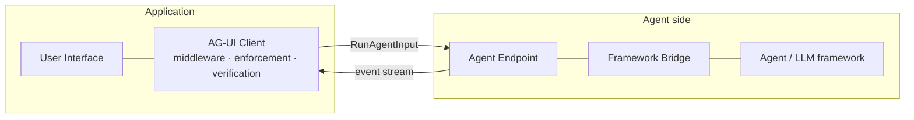
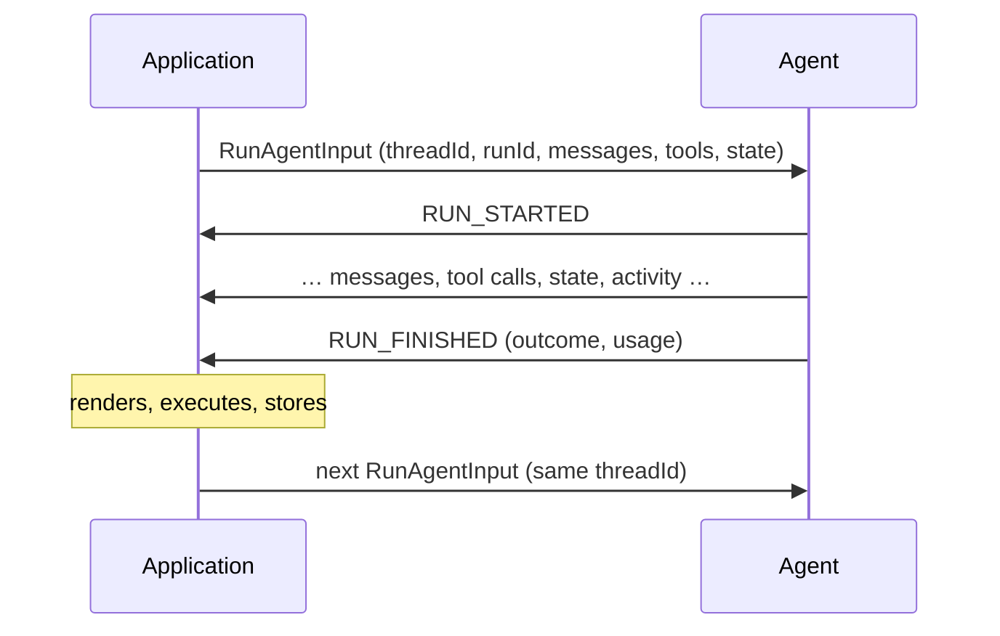

AG-UI connects agents to user-facing applications through one channel: an
ordered stream of typed events, answered to a single request. Everything the
user sees of the agent — text, tool calls, reasoning, state, progress — is in
the stream; there is no side channel.

## Core Components

### The application

Owns the user. It renders the stream, executes the
[tool calls](/spec/1.0/events/tool-calls) it advertised, keeps the
[state](/spec/1.0/events/state) the agent shares with it, and decides what
requires the user's consent.

### The client

The consumer's protocol machinery, usually an SDK. It sends the
[run input](/spec/1.0/basic/run-input), runs the
[processing pipeline](/spec/1.0/basic/processing) over what comes back —
compatibility translation, middleware, enforcement, chunk expansion,
verification — and hands the application a stream it can trust.

### The agent endpoint and its bridge

The producer. A bridge translates a framework's native events into protocol
events; the endpoint speaks a [transport binding](/spec/1.0/basic/transports).
The protocol carries no framework concepts, which is what lets one client face
any framework.

### Middleware

Code either side installs into the client's pipeline. It sees every event
**before** enforcement strips anything, so a compatibility shim can translate a
[retired shape](/spec/1.0/basic/versioning#retired-shapes) and an extension
can act on material the current version does not define.

## The run

The unit of interaction. A consumer opens an exchange with one
`RunAgentInput`; the producer answers with events bracketed by the
[run lifecycle](/spec/1.0/events/lifecycle) — the requested run, possibly
preceded by replayed history; the conversation is a thread of such runs,
accumulating messages and state.

## Design Principles

1. **Agents should be extremely easy to expose.** A bridge is a translation,
   not an implementation: whatever a framework emits maps onto a small set of
   event families, and everything optional is optional. The mandatory surface
   is the run lifecycle and nothing else.

2. **Everything observable is in the exchange.** Nothing about the agent's
   visible behaviour travels out of band: a recorder holding the exchanges —
   each run input and the events that answered it — reconstructs what the UI
   knew at every moment, which is what makes the protocol testable,
   replayable, and transport-agnostic.

3. **Tolerant reader, strict writer.** A producer MUST emit only what the
   schema defines; a consumer MUST survive what it does not recognise,
   stripping it with a warning rather than failing. The full asymmetry — and
   why a malformed known value is treated oppositely — is the
   [processing model](/spec/1.0/basic/processing).

4. **Middleware runs before enforcement.** Translation gets its chance
   before anything is stripped, so
   the protocol can evolve without stranding either side: yesterday's shapes
   are translated at the boundary, tomorrow's ride through to whoever knows
   them.

5. **Transports are bindings.** Semantics never vary by wire. The same events,
   the same rules, whether framed as SSE text or protobuf frames — with
   cross-implementation parity pinned by a shared byte corpus.
