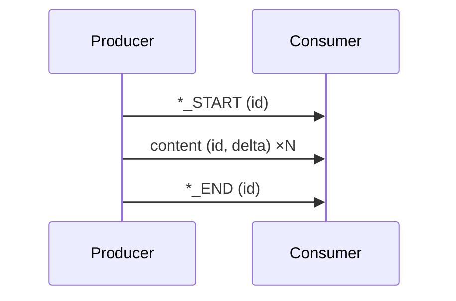
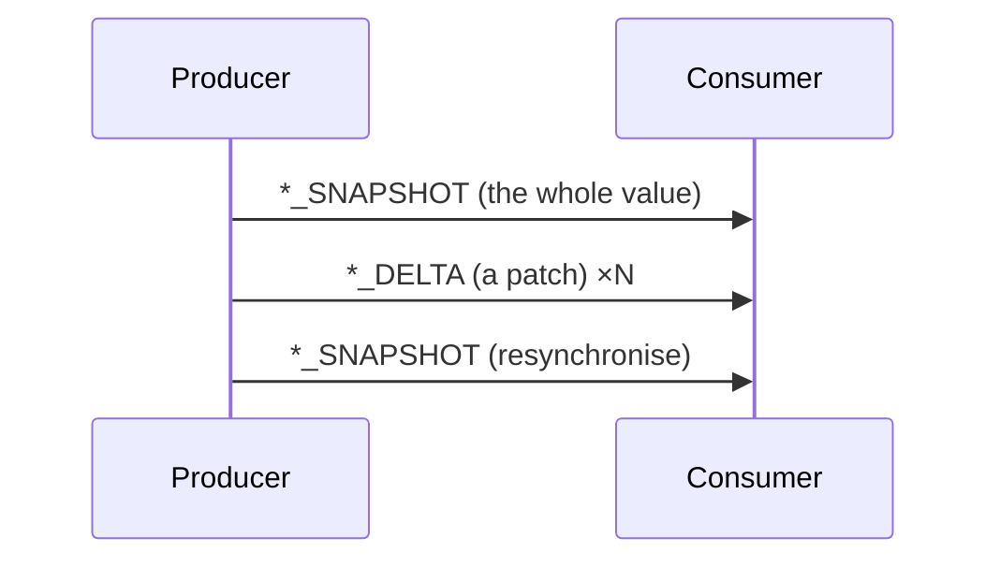
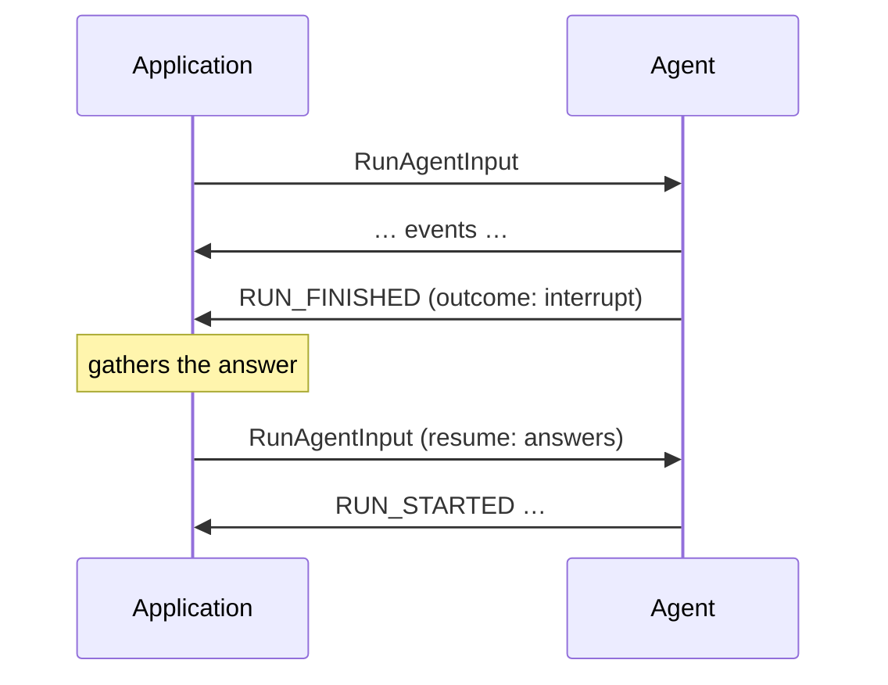

This page defines the event patterns of the core protocol: the ways a producer
composes events into a stream. Every
[transport](/spec/1.0/basic/transports) carries all of these patterns;
transports differ only in how events are framed and delivered.

The direction of the protocol is fixed. Events flow from producer to consumer;
the consumer speaks exactly once per exchange, by sending the
[run input](/spec/1.0/basic/run-input) that opens it. A producer MUST NOT
require any mid-run message from the consumer — a run that needs outside input
ends, and the answer arrives on the next run: through an interrupt and its
resume entries, or through a
[frontend tool call](/spec/1.0/events/tool-calls#frontend-tools) left
unanswered and answered in the next input's messages.

## Streaming

Long values arrive a piece at a time: a `*_START` opens an item, content
events extend it, a `*_END` closes it — or a chunked shorthand compresses the
three. Text messages, tool calls and reasoning messages all stream this way.

See [Streaming Messages](/spec/1.0/basic/patterns/streaming).

## Snapshot and delta

Values that evolve — agent state, activities, the conversation itself — are
carried as a snapshot that replaces and deltas that amend, with deltas
expressed as RFC 6902 JSON Patch.

See [Snapshots and Deltas](/spec/1.0/basic/patterns/snapshots).

## Interrupt and resume

A run that needs something from outside — an approval, a missing value — ends
with an interrupt outcome, and the run that continues from it carries the
answers in its input.

See [Interrupts and Resume](/spec/1.0/basic/patterns/interrupt-resume).

## Adding patterns

All protocol features are built from these patterns. A protocol revision that
adds a pattern defines it on this page. Transports carry new patterns without
changes, because patterns are expressed entirely in terms of events and the
run input.
