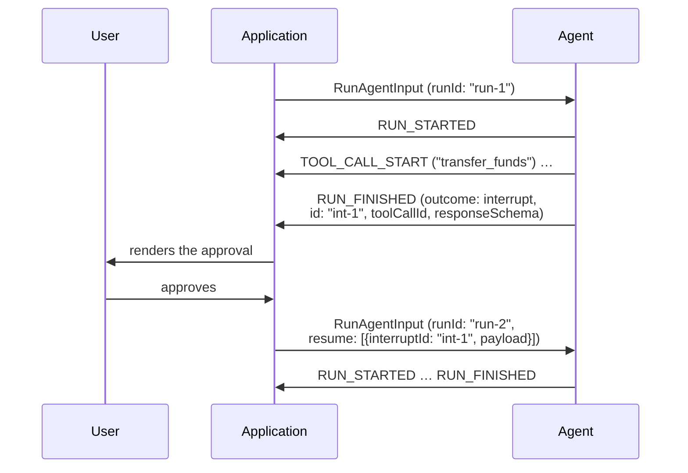

A run sometimes needs something only the outside world can give it — an
approval, a credential, a choice. The protocol has no mid-run channel from the
consumer, so the run does not wait: it ends, saying what it is waiting for, and
the run that continues from it carries the answers.

## Interrupting

A run that needs outside input ends with `RUN_FINISHED` whose `outcome` is the
interrupt outcome, carrying one or more `Interrupt` objects — at least one,
because an interrupt outcome with nothing to answer would leave a consumer
with nothing to do.

- A producer MUST NOT report an interrupted run as success: the interrupt
  outcome is the only conforming way to end a run that stopped to *ask* —
  where the producer names what it is waiting for and resume entries answer
  it. A run that stopped by calling a
  [frontend tool](/spec/1.0/events/tool-calls#frontend-tools) is the other,
  ordinary path: it finishes as success, naming the unanswered calls in the
  success outcome's `pendingToolCallIds`, and the answer rides the next
  input's messages. A run that stopped because it was *told to* is neither: it
  ends with the [cancelled outcome](/spec/1.0/events/lifecycle#cancelled-runs)
  and asks for nothing.
- Each interrupt's `id` MUST be unique within the run; a resume entry answers
  it by this id.
- An interrupt's `reason` is an open string — the protocol does not attempt to
  classify every reason an agent might need input. `message` is a
  human-readable prompt for whoever answers; `toolCallId` names the tool call
  an approval concerns; `responseSchema` describes the answer's expected shape,
  carried opaquely so a consumer can build a form for it.
- An interrupt raised inside a subagent MAY carry that subagent's
  `subagentRunId`; the [subagent rules](/spec/1.0/events/subagents) govern
  attribution and the suspended outcome that accompanies it.

An interrupted run is a closed run. Everything the
[run lifecycle](/spec/1.0/events/lifecycle) says about a closed run applies —
including the one late arrival it admits, a `RUN_ERROR` reporting a failure
that surfaced after the close — and continuing means a new run.

## Resuming

The run that continues carries its answers in the input's `resume` list, one
`ResumeEntry` per interrupt answered:

- Each entry's `interruptId` MUST name an interrupt from the run being
  continued — the most recent interrupted run on the thread.
- An entry's `status` says whether the interrupt was answered or abandoned;
  `payload` carries the answer the agent asked for, any JSON value; `metadata`
  is envelope information about the response, not part of the answer.
- The resume list MUST cover every interrupt of the run being continued: each
  one answered, or explicitly abandoned by an entry with the abandoned status.
  Omission is not abandonment. Coverage is the *consumer's* rule to enforce:
  the consumer holds the interrupts the closing `RUN_FINISHED` delivered and
  it assembles the resume list, so it is the one participant that can always
  tell whether the list is complete. A consumer MUST reject a resuming input
  that leaves an interrupt uncovered before the run starts — before anything
  is sent — and MUST NOT silently continue past an interrupt it has no entry
  for. The producer is not asked to check this, and needs to retain nothing
  from the interrupted run to be conformant; what it does when a defective
  consumer sends an incomplete list anyway is its error handling, below. What
  an abandoned interrupt means for the agent's work is the producer's
  business.
- `expiresAt` is deliberately format-unconstrained, so *whether* an interrupt
  has expired is the judging consumer's own reading of it — the reference
  reads it as a date and treats now-or-earlier as expired. The rule attaches
  to the judgment, not to a parse the schema refuses to specify: an interrupt
  the consumer judges expired can no longer be *answered* — the consumer
  rejects a resume entry resolving it before the run starts, as it rejects an
  uncovered interrupt. It can still be — and, coverage being mandatory, must
  be — abandoned, which is how a thread moves past an interrupt nobody
  answered in time.
- Thread and state continuity hold across the gap: the resuming run carries the
  same `threadId`, the accumulated messages, and the state the interrupted run
  left behind, exactly as any [sequential run](/spec/1.0/events/lifecycle)
  does.
- Token usage does not carry across the gap: the resuming run's `usage`
  [covers](/spec/1.0/events/lifecycle#token-usage) only the model calls it
  made itself. The interrupted run already reported its own on the
  `RUN_FINISHED` that interrupted it.

A producer receiving resume entries treats them as the answers it stopped for.
The list is the consumer's complete statement of what was decided, and the
producer takes it as such: it is not required to remember the interrupts of a
prior run, to compare the list against them, or to keep any state between
runs for that purpose. A producer that carries nothing across the gap is
conformant.

Two violations of the consumer's rules can nevertheless reach a producer. What
follows is the producer's error handling for them, not permission to send them.

- **An unrecognised entry** — one naming an interrupt the producer did not
  raise: the run SHOULD proceed without the entry, and the producer SHOULD
  surface a warning rather than fail a run over an answer it never asked for.

- **An uncovered interrupt** — one the producer can tell is still open and
  has no entry, because it kept the interrupted run's checkpoint, or because
  the messages carry an approval-gated tool call with neither a result nor an
  entry answering it.
  A producer MUST NOT perform the interrupted action on the strength of an
  absent entry, and MUST NOT treat the omission as abandonment — dropping the
  call with a warning and finishing as success would let a defective consumer
  abandon what nobody decided to abandon, which is the outcome the coverage
  rule exists to prevent. Having noticed, the producer keeps the interrupt
  open. It MAY reject the input before the run starts, as any invalid input
  (a stream opening with `RUN_ERROR`, or the transport's own rejection of the
  request); or it MAY run what the covered entries permit and end with the
  interrupt outcome again, carrying the still-open interrupt so the consumer
  gets another chance to answer it. Either way the run MUST NOT end as
  success while an interrupt the producer knows to be open stands
  unanswered. A producer that cannot tell — the stateless case above — is
  under no obligation here, because it has nothing to notice.

## Message Flow

## Data Types

[`RunFinishedInterruptOutcome`](/spec/1.0/schema#runfinishedinterruptoutcome), [`Interrupt`](/spec/1.0/schema#interrupt) and [`ResumeEntry`](/spec/1.0/schema#resumeentry) are defined by the
[schema reference](/spec/1.0/schema). `expiresAt`, when present, conventionally
carries an ISO 8601 timestamp; the schema deliberately does not constrain its
format.

## Error Handling

A success outcome carrying interrupts is a contradiction the schema already
rejects — the success outcome is closed. A resume list on a run that does not
continue an interrupted run answers nothing; producers treat its entries as
unrecognised, as above.
