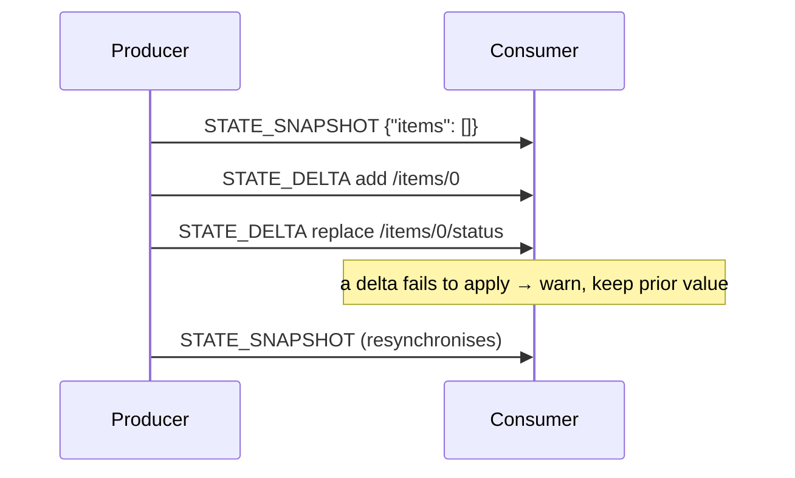

Some of what a producer reports is not a stream of text but a value that
evolves: the agent's state, an activity's content, the conversation itself.
These travel as **snapshots**, which replace, and **deltas**, which amend.

Three families use the pattern:
[state](/spec/1.0/events/state) (`STATE_SNAPSHOT`, `STATE_DELTA`, and
`MESSAGES_SNAPSHOT` for the conversation) and
[activity](/spec/1.0/events/activity) (`ACTIVITY_SNAPSHOT`,
`ACTIVITY_DELTA`). This page states what they share; the family pages state
what each replaces and amends.

## Snapshots

A snapshot carries the whole value. A consumer MUST replace its copy with the
snapshot's content — a snapshot is not a merge — unless the snapshot itself
opts out through a field its family defines
([activity](/spec/1.0/events/activity)'s `replace: false` is the one case).
Whatever deltas came before it are spent: the snapshot, applied or declined,
is the new baseline moment.

A producer MAY send a snapshot at any time, and SHOULD send one whenever it
cannot guarantee that the consumer's baseline matches its own — after an error,
after content a delta cannot express, or at the start of a run that continues
an old thread.

## Deltas

A delta amends the current value, expressed as an
[RFC 6902](https://datatracker.ietf.org/doc/html/rfc6902) JSON Patch: an array
of operations applied in order, atomically — if any operation fails, the
document is left as it was.

- A delta applies against the consumer's current value: the last snapshot as
  amended by every delta since. For state, the value a run starts from is the
  input's `state`, or the empty object when the input
  [carried none](/spec/1.0/basic/run-input#state).
- A producer MUST NOT send a delta for a value it has given the consumer no
  baseline for. What counts as a baseline is the family's business — state has
  one from the input, an activity only after its first snapshot.
- Patch operations are deliberately open objects: the schema marks them so, and
  a member RFC 6902 does not define is protocol-legal material the
  [processing model](/spec/1.0/basic/processing) MUST NOT strip.

## When a patch does not apply

Structural validity does not mean a patch applies: a well-formed operation may
point at a path that does not exist, and RFC 6902 leaves that to the applier. A
malformed *operation* — a patch that is not an array, an operation missing a
required member or carrying one of the wrong type — is a malformed known value
and fatal like any other. An operation whose `op` names something RFC 6902
does not define is not malformed but unrecognised — a member of a
discriminated union added after this consumer shipped — and the
[processing model](/spec/1.0/basic/processing)'s list rule applies: the
element is dropped from the patch with a warning and the run survives. A
well-formed patch that fails to apply is different again:

- The consumer MUST NOT keep a partially applied result — RFC 6902 application
  is atomic.
- The consumer MUST surface the failure — a warning that identifies what
  failed and why, well enough to diagnose — and MAY continue with its prior
  value rather than failing the run.
- A `test` operation that fails is this same case: the patch does not apply,
  and the consumer keeps its prior value.

From that point the consumer's value may have diverged from the producer's. A
producer that learns of it, or that cannot rule it out, SHOULD resynchronise
with a snapshot; a consumer MUST adopt the next snapshot regardless of what it
skipped before it — that is what makes recovery possible.

## Message Flow

## Data Types

The patch shape — [`JsonPatch`](/spec/1.0/schema#jsonpatch), its operations, [`JsonPointer`](/spec/1.0/schema#jsonpointer) — is defined by
the [schema reference](/spec/1.0/schema), by reference to RFC 6902.
