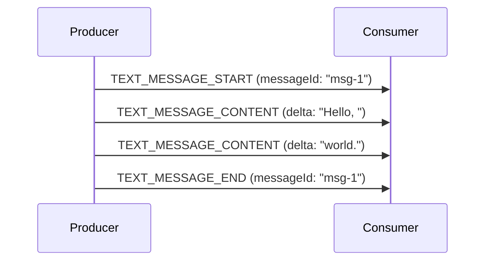
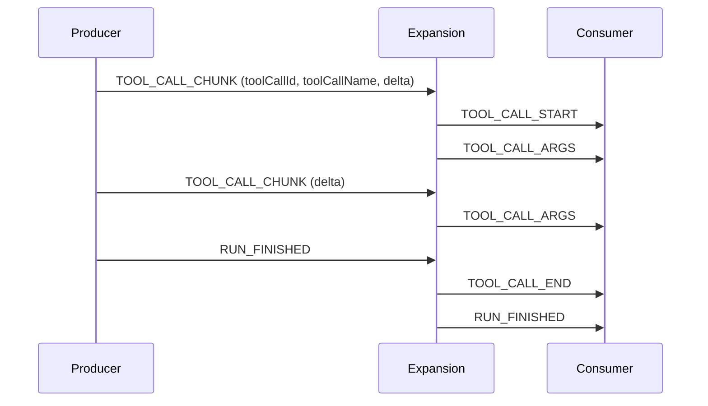

Three event families stream long values a piece at a time: text messages, tool
calls, and reasoning messages. All three follow one pattern with two spellings —
an explicit **open–content–close** triad, and a compact **chunked** form for
producers that would otherwise have to buffer. This page defines the pattern
once; the family pages ([text messages](/spec/1.0/events/text-messages),
[tool calls](/spec/1.0/events/tool-calls),
[reasoning](/spec/1.0/events/reasoning)) add only what is specific to each
family.

## Open, content, close

A streamed item is opened by its `*_START` event, extended by zero or more
content events, and closed by its `*_END` event, all matched by the item's
identifier (`messageId` for messages, `toolCallId` for tool calls).

- A producer MUST NOT open an item whose identifier is already open.
- A producer MUST NOT send a content or end event for an identifier that is
  not open.
- Every item a producer opens MUST be closed before the run finishes.

The opening event carries the fields that describe the item; content events
carry only the identifier and a `delta`. Deltas concatenate in arrival order to
form the item's value.

## Interleaving

Messages, tool calls, reasoning messages and steps are independent. A producer
MAY interleave them freely — a tool call MAY open while a message is still
streaming — provided each item respects its own open/close discipline.

Standalone events (`STATE_SNAPSHOT`, `STATE_DELTA`, `MESSAGES_SNAPSHOT`,
`ACTIVITY_SNAPSHOT`, `ACTIVITY_DELTA`, `CUSTOM`, `RAW`,
`REASONING_ENCRYPTED_VALUE`) open and close no items of their own, and MAY
appear anywhere within an open run. In the chunked form, some of them do end
an open chunk stream — arriving is what tells the consumer the shorthand can
no longer continue — as [Closing a chunk stream](#closing-a-chunk-stream)
lists.

## The chunked form

`TEXT_MESSAGE_CHUNK`, `TOOL_CALL_CHUNK` and `REASONING_MESSAGE_CHUNK` are a
compact spelling of the triad. A consumer MUST expand them into the
start/content/end form before verification and before application code, so
every rule of the triad applies to the expanded events. Where expansion sits
relative to enforcement and middleware is specified in the
[processing model](/spec/1.0/basic/processing); the invariant that holds on
every path is that a chunk is judged as the event it is — whichever stage
meets a malformed chunk first rejects it rather than repairs it.

The two spellings do not mix within one item. An item opened by a chunk is
continued and closed in chunk form — its `*_END` is synthesized, never sent —
and an item opened by a `*_START` is continued and closed explicitly. An
explicit event carrying an identifier a chunk stream is assembling is not a
continuation of it: it ends the shorthand, as
[Closing a chunk stream](#closing-a-chunk-stream) describes, and what follows
is judged by the triad rules — which makes mixing the forms within one item a
malformed sequence a producer MUST NOT emit.

### The first chunk

The first chunk of an item carries what opening it requires; later chunks MAY
omit those fields and continue what is already open.

- The first `TEXT_MESSAGE_CHUNK` for a message MUST carry `messageId`. It MAY
  carry `role`; an absent role means `assistant`, exactly as on
  `TEXT_MESSAGE_START`.
- The first `REASONING_MESSAGE_CHUNK` for a message MUST carry `messageId`.
- The first `TOOL_CALL_CHUNK` for a call MUST carry both `toolCallId` and
  `toolCallName`.

A consumer MUST treat a first chunk missing a required field as a protocol
violation rather than inventing an identifier.

### Continuation chunks

- A later chunk that carries an identifier MUST carry the same identifier it is
  continuing. A chunk that names a different identifier opens a new item, and
  the previous one closes first.
- A continuation chunk MAY repeat a field its opener established — `role` or
  `name` on a text message, `toolCallName` or `parentMessageId` on a tool call —
  but only with the same value. A consumer MUST treat a conflicting repeat as a
  protocol violation. This includes a value conflicting with one the opener
  established by omission: a message opened without a role is an `assistant`
  message, and a later chunk claiming another role contradicts it.

<Note>
  The conflicting-repeat rule is the same judgment the
  [subagent attribution rules](/spec/1.0/events/subagents) pass on a
  continuation that disagrees with its opener about `subagentRunId`: the
  producer has said two incompatible things about one item, and there is no
  correct way to choose between them.
</Note>

### Closing a chunk stream

The chunked form has no explicit end event, so the consumer synthesizes the
`*_END` when the stream can no longer continue:

- when a chunk opens a different item in the same lane;
- when a message, tool-call, step, state, custom or reasoning event arrives in
  the item's lane — with four exceptions that stand aside from assembly and
  close nothing: `RAW`, `ACTIVITY_SNAPSHOT`, `ACTIVITY_DELTA`,
  `REASONING_ENCRYPTED_VALUE` (and `SUBAGENT_STARTED`, which opens a new lane
  rather than touching this one);
- when a run-level event arrives — `RUN_STARTED`, `RUN_FINISHED`, `RUN_ERROR`
  or `MESSAGES_SNAPSHOT` — which closes every lane, or when the subagent the
  item is attributed to terminates, which closes that subagent's lane.

Which lane a shorthand continuation belongs to — the parent agent's or a
subagent's — is decided by the [attribution rules](/spec/1.0/events/subagents),
and for a continuation carrying neither an identifier nor a tag, by
resolution: it continues the parent agent's open stream of its kind when one
exists, and otherwise the sole open stream of its kind. When several lanes
hold open streams of that kind and none of them is the parent's, the
continuation has no unique referent and MUST be rejected as ambiguous — a
producer running parallel subagents MUST attribute its continuations. A chunk
stream MUST NOT outlive its owner: an item opened by a subagent closes no
later than that subagent's terminal event.

### Chunk metadata

A chunk's `metadata` applies to the events synthesized from that chunk, and
merges into the item under the
[metadata rules](/spec/1.0/basic/metadata). A continuation chunk that
carries only metadata — a final chunk reporting usage and a finish reason — is
legal: it adds no content, and its metadata still reaches the item it
continues.
