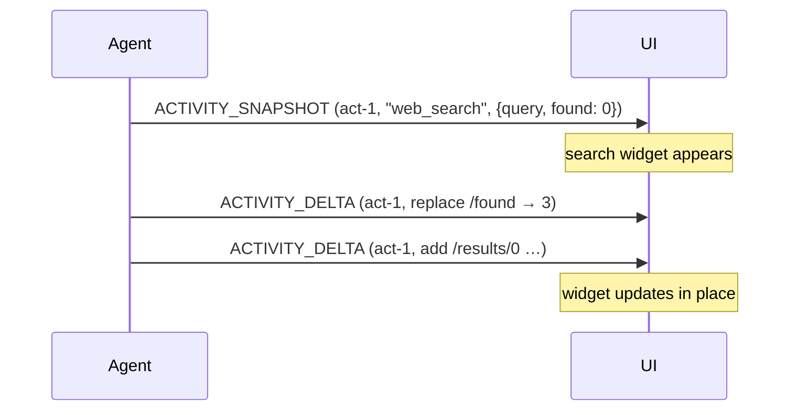

Activity is structured progress that is not conversation content — a search
running, a checklist filling in, a step a UI renders as its own widget. It is
materialised as a message so it keeps its place in the sequence, but its
content is an object, not text.

## Events

Activity binds the [snapshot–delta pattern](/spec/1.0/basic/patterns/snapshots),
scoped per activity message and matched by `messageId`.

### `ACTIVITY_SNAPSHOT`

Creates or replaces one activity message.

```json
{
  "type": "ACTIVITY_SNAPSHOT",
  "messageId": "act-1",
  "activityType": "web_search",
  "content": { "query": "…", "found": 3 }
}
```

- `activityType` is an open string: the set is the producer's, not the
  protocol's. A consumer MUST tolerate types it does not recognise.
- A snapshot for a `messageId` the consumer has not seen creates the activity
  message, in sequence position at the point of arrival.
- A snapshot for an existing activity replaces its content and its
  `activityType`. `replace` is OPTIONAL; absent means it does, and that
  meaning is normative. An explicit `replace: false` asks the consumer to
  leave the existing message as it stands — content *and* `activityType`; the
  snapshot's own values apply only when it creates the message. It is not a
  merge.
- Replacement replaces *content*, not the metadata accumulated so far —
  metadata keeps merging under the
  [metadata rules](/spec/1.0/basic/metadata). Attribution is the
  exception: a replacing snapshot re-mints the activity, so the message's
  `subagentRunId` becomes the snapshot's own, including becoming absent.
- A `replace: false` snapshot for an existing activity does not re-mint
  ownership: the established owner stands, and the snapshot's own attribution
  MUST agree with it. The producer duty is the same one the
  [subagent rules](/spec/1.0/events/subagents) put on streamed
  continuations; the consumer obligation is deliberately weaker — the
  established owner stands and a consumer is not required to reject the
  disagreement, where a streamed continuation's mismatch must be rejected.

### `ACTIVITY_DELTA`

Amends one activity message's content with an RFC 6902 patch against it. The
delta's `activityType` replaces the message's — a delta MAY retype the
activity it amends, and a delta that does not intend to MUST repeat the
current type, since the field is required.

- A producer MUST NOT send a delta for an activity message it has not created
  with a snapshot — the snapshot is the baseline the
  [pattern](/spec/1.0/basic/patterns/snapshots) requires.
- A delta naming a message that does not exist, or one that is not an activity
  message, is skipped; the consumer SHOULD surface a warning, and MUST NOT
  fail the run.
- The patched result MUST still be an object: `content` is one by schema, and
  a producer MUST NOT send a patch — a root replacement, say — whose
  application would make it anything else. A consumer is not required to
  detect the violation.
- Patch failure handling is the
  [pattern](/spec/1.0/basic/patterns/snapshots#when-a-patch-does-not-apply)'s,
  with resynchronisation by a fresh snapshot of the same `messageId`.

## Activity messages in the conversation

An activity message appears in history with the fixed role `activity`. It is
rendering material for the consumer, not conversation the agent resumes from:
a consumer MUST strip activity messages from the `messages` it sends in
[run input](/spec/1.0/basic/run-input). How activity messages survive a
`MESSAGES_SNAPSHOT` is specified with that
[event](/spec/1.0/events/state#messages_snapshot).

## Message Flow



## Data Types

[`ActivitySnapshotEvent`](/spec/1.0/schema#activitysnapshotevent), [`ActivityDeltaEvent`](/spec/1.0/schema#activitydeltaevent) and [`ActivityMessage`](/spec/1.0/schema#activitymessage) are defined
by the [schema reference](/spec/1.0/schema). [`ActivityMessage`](/spec/1.0/schema#activitymessage) stands alone rather
than composing the base message, because its content is an object rather than
a string.

## Error Handling

Malformed activity events are fatal as malformed known values. The two
tolerated failures — a delta against a missing or non-activity message, and a
well-formed patch that does not apply — warn and skip, as above; both leave
the producer and consumer possibly disagreed about that activity, which the
producer's next snapshot repairs.
