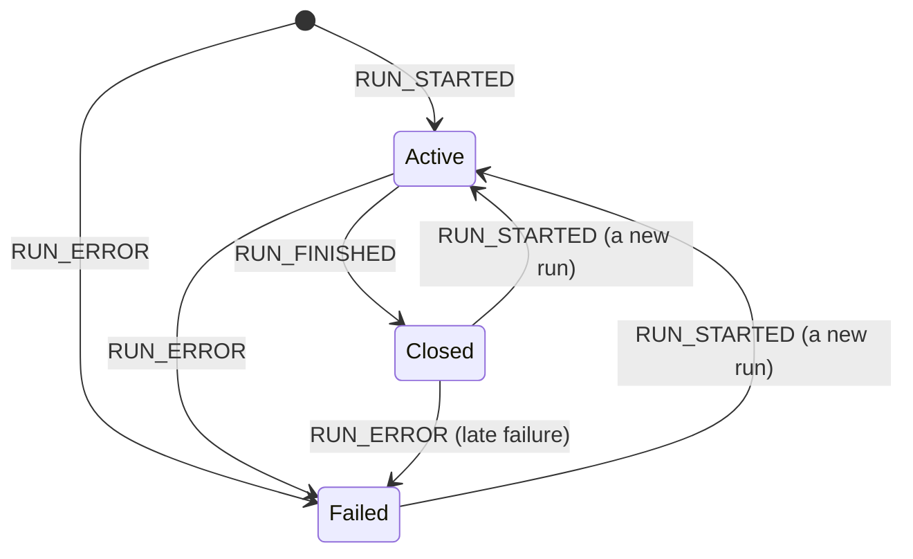

A consumer sends a [`RunAgentInput`](/spec/1.0/basic/run-input); a producer
answers with a stream of events carrying one or more runs — the requested run,
possibly preceded by replayed history. This page states when a run begins and
ends and what those boundaries mean; the ordering rules *inside* a run belong
to the [event patterns](/spec/1.0/basic/patterns).

## The run

A stream MUST begin with `RUN_STARTED` or `RUN_ERROR`. A producer MUST NOT emit
any other event first, and a consumer MUST treat a stream that opens with
anything else as a protocol violation. `RUN_ERROR` is admitted first because a
run can fail before it begins — a transport that cannot reach the agent has a
failure to report and no run to report it against.

### `RUN_STARTED`

Opens the run. It carries the run's identifiers; the producer's own
`protocolVersion` declaration, per the
[versioning rules](/spec/1.0/basic/versioning#version-negotiation); and MAY
echo the input the run was started from, so a consumer that did not make the
request can still see what the agent was asked. `parentRunId` names the run that spawned this
one,
when an agent invokes another agent as a separate run rather than as a
[subagent](/spec/1.0/events/subagents) within one.

### `RUN_FINISHED`

Closes a run that did not fail, and reports how it ended:

- Its `outcome` distinguishes a run that completed from one interrupted
  awaiting outside input, and from one stopped before it completed; an absent
  outcome means success. The interrupt outcome and what follows it are
  specified in
  [Interrupts and Resume](/spec/1.0/basic/patterns/interrupt-resume); the
  cancelled outcome is specified [below](#cancelled-runs). The outcome reports
  what the producer knows about why the run ended: a run that stopped on a
  [frontend tool call](/spec/1.0/events/tool-calls#frontend-tools) is a
  completed run whose success outcome MAY name the calls it left unanswered in
  `pendingToolCallIds`, because whether the application continues the thread
  after such a call is the application's decision, not the producer's.
- A producer MUST NOT send an outcome value the schema does not describe.
- `result` is OPTIONAL and carries the run's return value, if it has one.
- `usage` is OPTIONAL and reports token usage, one entry per provider and
  model, under the [accounting below](#token-usage). A consumer that only
  wants totals sums across the entries.

An outcome a consumer does not recognise is unrecognised material like any
other, and is stripped on the same terms as the rest. Stripping an optional
field leaves it absent, and an absent outcome means success — so a consumer is
not required to tell a run that completed from one that ended for a reason
named after that consumer shipped.

<Note>
  This bounds how far the outcome set can usefully grow. A terminal state added
  in a later version reaches an older consumer as a successful run, so a version
  that needs older consumers to *notice* a new way of ending cannot say so
  through `outcome` alone — it needs a carrier those consumers already treat as
  significant. It is also why the cancelled outcome below is named in 1.0
  rather than left for later: added afterwards, a cancelled run would reach
  every 1.0 consumer as a completed one.
</Note>

### Cancelled runs

A run can be stopped on purpose before it completes — by the person it is
running for, by the application's own code, by a limit the producer enforces.
It did not fail, and it is not waiting for anything, but it did not complete
either, and a consumer that cannot tell it from a completed run presents
partial work as the whole. The cancelled outcome names that ending.

- A producer that stops a run before completion, for a reason that is not a
  failure, MUST close it with `RUN_FINISHED` carrying the cancelled outcome.
  It MUST NOT report a stopped run as success — neither with the success
  outcome nor by omitting the outcome.
- Everything that holds for a closed run holds here. A producer MUST close
  what the run opened — messages, tool calls, steps, subagents — before the
  `RUN_FINISHED` that cancels it, exactly as before one that succeeds. Closing
  a tool call establishes that its argument text is complete, not that it is
  valid, so a call cut off mid-arguments closes like any other and what to do
  with arguments that do not parse is the application's decision, per the
  [tool call rules](/spec/1.0/events/tool-calls#tool_call_end). A producer
  that cannot close in order — the stop tore down the stream under it —
  reports `RUN_ERROR` instead: that run did not end cleanly, and `RUN_ERROR`
  is the event for a run that did not.
- A cancelled run has no return value: `result` SHOULD be absent. `usage` MAY
  report the tokens accrued before the stop.
- A cancelled run waits for nothing. Its outcome carries no interrupts, and
  the next run on the thread is an ordinary new run, not a resume.
- A consumer MUST NOT present a cancelled run as having succeeded, and MUST
  NOT present it as having failed — a stop the user asked for is not an error
  to show them. Everything the run delivered before the stop remains
  delivered, as after `RUN_ERROR`. How to surface the stop beyond that is the
  consumer's business.

Cancellation is a producer's report about a run it was running. A consumer
that abandons a stream — closes the connection, stops reading — has a
[truncated run](/spec/1.0/basic/transports#truncation), not a cancelled one:
it MUST NOT synthesize a `RUN_FINISHED`, cancelled or otherwise, for a run
whose ending it never received.

### `RUN_ERROR`

Ends a run that failed. `message` says what went wrong, for a person to read;
`code` is OPTIONAL and machine-readable, an open string the protocol defines no
vocabulary for; `usage` MAY report tokens accrued before the failure, under
the same [accounting](#token-usage) as on `RUN_FINISHED`.

A `RUN_ERROR` is a well-formed event: the producer is reporting its own
failure, not sending something a consumer should reject. Treating a run as
failed means a consumer MUST surface the failure to application code and MUST
NOT report the run as having succeeded. It does not prescribe how — whether the
call that started the run raises, resolves with the failure, or reports it
through a callback is the implementation's business, and two conforming
consumers may differ.

### Token usage

`usage` on `RUN_FINISHED` and `RUN_ERROR` reports what the run's model calls
cost, one [`TokenUsage`](/spec/1.0/schema#tokenusage) entry per provider and
model. Providers count differently — one folds cached prompt tokens into its
input count, another reports them beside it, a third reports reasoning apart
from the rest of the output — so the protocol fixes one accounting and the
producer translates into it. Every count is either a total or a named part of
one:

- `inputTokens` is every prompt token the call was charged for: cached or not,
  written to a cache or not, text or not. `outputTokens` is every generated
  token, reasoning included.
- `cachedInputTokens` (cache reads), `cacheWriteInputTokens` (cache writes) and
  `reasoningTokens` are parts of those totals, never additions to them. The two
  cache counts are disjoint. A producer whose provider reports one of these
  beside a smaller total MUST add it into the total before emitting the entry;
  a producer whose provider already includes it MUST NOT add it again.
- `totalTokens` is `inputTokens` plus `outputTokens`. A producer MAY compute it
  rather than copy a provider's total, and MUST NOT copy a provider's total
  that counts differently.
- An absent count means the provider did not report it; a zero means it
  reported zero. A producer MUST NOT emit a zero for a count it has no data
  for, and a consumer MUST NOT read an absent count as zero.

The run is the accounting boundary:

- Usage covers every model call made within the run, including calls made by
  its [subagents](/spec/1.0/events/subagents): subagent events carry no
  usage of their own, and a subagent's calls are the run's.
- An agent invoked as a separate run — named by `parentRunId` — reports its
  own usage on its own terminal event, and the run that spawned it MUST NOT
  include that usage in its own.
- A run that [resumes](/spec/1.0/basic/patterns/interrupt-resume) an
  interrupted one reports only the calls it made itself. The interrupted run
  already reported its own, and a consumer wanting a thread's total sums
  across the thread's runs.

Under this accounting a consumer that only wants a total sums `totalTokens`
across entries and runs, and a consumer computing cost has each part it needs
to price cache reads, cache writes and reasoning at their own rates, without
double-counting any of them.

### After a run closes

A run ends with `RUN_FINISHED` or `RUN_ERROR`, after which it is closed. Once a
run has closed:

- A producer MUST NOT emit any further event for that run, other than the two
  named below.
- A producer MAY emit `RUN_STARTED` to begin a new run on the same stream.
- A producer MAY emit `RUN_ERROR` after `RUN_FINISHED`, reporting a failure
  that surfaced after the run reported success — a transport error while
  flushing, say. A consumer MUST treat the run as failed in that case.
- A producer MUST NOT emit anything after `RUN_ERROR` except `RUN_STARTED`.

A consumer MUST reject any other event that arrives after a run has closed.

### Several runs on one stream

A single stream MAY carry several runs in sequence — a replayed thread is the
common case. A producer MUST close the current run before opening the next: a
`RUN_STARTED` while a run is still active is a violation.

Across runs within a stream, messages accumulate and
[state](/spec/1.0/events/state) persists unless an event replaces it. A
producer restating history — a replayed thread whose material the consumer's
input already carried — MUST restate it as snapshots: `MESSAGES_SNAPSHOT`
reconciles by id and `STATE_SNAPSHOT` replaces, so a restatement the consumer
already holds is idempotent. Re-streaming a message the consumer already has
appends to it rather than restating it, which is why the streaming triads are
for new material only.

Run-scoped tracking — open messages, open tool calls, open steps, active
subagents — does not cross the boundary: `RUN_FINISHED` requires everything the
run opened to be closed already, and `RUN_ERROR` ends whatever was still open
along with the run. A new run starts with nothing open.

## Steps

Steps mark a run's phases, for a UI that shows progress. `STEP_STARTED` opens a
step and `STEP_FINISHED` closes it, matched by `stepName`.

- A producer MUST NOT open a step whose name is already open, and MUST NOT
  finish a step that was never opened.
- Every step a producer opens MUST be closed before the run finishes.
- Steps MAY overlap each other and anything else in the run; a step is a label
  over a span of the stream, not a container.

## Data Types

The event shapes are defined by the [schema reference](/spec/1.0/schema):
[`RunStartedEvent`](/spec/1.0/schema#runstartedevent), [`RunFinishedEvent`](/spec/1.0/schema#runfinishedevent) (with [`RunFinishedOutcome`](/spec/1.0/schema#runfinishedoutcome)),
[`RunErrorEvent`](/spec/1.0/schema#runerrorevent), [`StepStartedEvent`](/spec/1.0/schema#stepstartedevent), [`StepFinishedEvent`](/spec/1.0/schema#stepfinishedevent), and [`TokenUsage`](/spec/1.0/schema#tokenusage).

## Error Handling

Two different things end a run badly, and a consumer keeps them apart.

A **stream the consumer rejects** is a protocol violation it detected:
everything on this page a producer MUST NOT do is fatal when a consumer sees
it — an event before `RUN_STARTED`, an event after close other than the two
admitted, a nested `RUN_STARTED`, an unbalanced step, or anything still open at
`RUN_FINISHED`. The producer is at fault and the stream is not trustworthy.

A **run that reports its own failure** with `RUN_ERROR` is the opposite: a
conforming producer saying its work did not succeed. The stream is well formed
and the consumer accepts it, per the rule above.

A consumer MUST NOT present one as the other. A failed run of either kind keeps
everything it delivered before failing — `RUN_ERROR` says the run did not
complete, not that its events did not happen.
