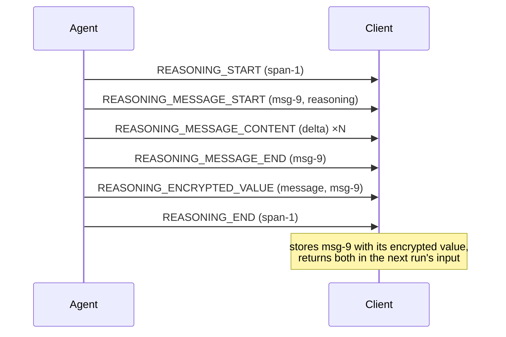

Reasoning is what the model thinks before it answers. A producer streams it so
a UI can show work in progress, and — where a provider keeps the real chain of
thought private — carries an encrypted artefact the consumer stores and
returns without being able to read.

## User Interaction Model

Reasoning is typically rendered apart from the conversation — collapsed by
default, styled as thinking. The protocol does not mandate any presentation; a
consumer MAY hide reasoning entirely.

## Events

### Spans: `REASONING_START` and `REASONING_END`

A reasoning span brackets one stretch of thinking, opened by `REASONING_START`
and closed by `REASONING_END`, matched by `messageId`. A span MAY contain
several reasoning messages.

- A producer MUST NOT open a span whose `messageId` is already open, MUST
  close every span it opens before the run finishes, and MUST NOT close a
  span it did not open.
- The span's identifier namespaces nothing: the reasoning messages inside a
  span carry their own `messageId`s.

### Reasoning messages

Reasoning messages follow the
[streaming pattern](/spec/1.0/basic/patterns/streaming):
`REASONING_MESSAGE_START` opens one (its `role` is fixed, `reasoning`),
`REASONING_MESSAGE_CONTENT` extends it, `REASONING_MESSAGE_END` closes it, all
matched by `messageId` — and `REASONING_MESSAGE_CHUNK` is the compact spelling,
whose first chunk MUST carry `messageId`. The pattern's rules apply exactly as
for text messages.

A consumer MUST detect a violation of that discipline and fail the run, on
spans and on reasoning messages alike:

- A `REASONING_MESSAGE_CONTENT` or `REASONING_MESSAGE_END` naming a message
  nothing opened has no referent, and a consumer MUST NOT invent the message
  an orphaned fragment names. The same shape is rejected for a text message;
  reasoning is not the exception.
- A `REASONING_END` naming a span nothing opened is rejected the same way, as
  is a `REASONING_START` reopening a span already open.
- A `REASONING_MESSAGE_START` naming a reasoning message that is already open
  is rejected too — the message must be closed with `REASONING_MESSAGE_END`
  before its `messageId` is used again. A span and the message inside it MAY
  share an identifier, so each is checked against its own open set.
- A span or a reasoning message still open when the run finishes fails the
  run.

Spans and reasoning messages are separate namespaces: a `REASONING_START` opens
a span and no message, so a fragment naming a span's `messageId` is orphaned
like any other.

### `REASONING_ENCRYPTED_VALUE`

Carries a provider's opaque, encrypted reasoning artefact. `subtype` says what
kind of thing `entityId` names — a message or a tool call — which decides where
the value is stored.

- A consumer MUST treat `encryptedValue` as opaque: never parsed, never
  interpreted, never assumed to be any particular format.
- A consumer MUST store the value with the message or tool call it names and
  return it unmodified in later run input, so the producer can restore the
  reasoning context it stands for. The rule presumes a target that can hold
  it: activity messages carry no encrypted value by schema, so an event
  naming one is treated as naming nothing the consumer knows — the
  unknown-`entityId` case below.
- A consumer that cannot preserve it — a downgrade path, a store that cannot
  carry it — is losing content and MUST warn
  ([Versioning](/spec/1.0/basic/versioning)).
- The artefact rides its message. A [`MESSAGES_SNAPSHOT`](/spec/1.0/events/state)
  restating the message replaces it wholesale, `encryptedValue` included — so
  a producer that still needs the artefact MUST restate it in the snapshot's
  copy, and one that omits it has withdrawn its own artefact. The consumer's
  duty is to return what it holds once all events have applied, not to
  resurrect what a snapshot removed.

The event is standalone: it opens nothing, closes nothing, and MAY appear
anywhere within an open run, though it conventionally arrives inside the span
whose thinking it captures.

## Message Flow

## Data Types

The event shapes are defined by the [schema reference](/spec/1.0/schema):
[`ReasoningStartEvent`](/spec/1.0/schema#reasoningstartevent), [`ReasoningEndEvent`](/spec/1.0/schema#reasoningendevent), [`ReasoningMessageStartEvent`](/spec/1.0/schema#reasoningmessagestartevent),
[`ReasoningMessageContentEvent`](/spec/1.0/schema#reasoningmessagecontentevent), [`ReasoningMessageEndEvent`](/spec/1.0/schema#reasoningmessageendevent),
[`ReasoningMessageChunkEvent`](/spec/1.0/schema#reasoningmessagechunkevent), [`ReasoningEncryptedValueEvent`](/spec/1.0/schema#reasoningencryptedvalueevent). In conversation
history a reasoning message is a [`ReasoningMessage`](/spec/1.0/schema#reasoningmessage).

## Error Handling

A `REASONING_ENCRYPTED_VALUE` whose `entityId` names nothing the consumer
knows cannot be stored where it belongs; a consumer SHOULD warn and MAY drop
it, and MUST NOT fail the run over it.

A malformed reasoning event — a missing required field, a `subtype` that is
not a string — is a malformed known value and fatal like any other. A
`subtype` that is a string the schema does not name is different: it is
unrecognised material — a member added after this consumer shipped — and the
[processing model](/spec/1.0/basic/processing) strips it with a warning,
which in a required position removes the event that carried it.

## Security Considerations

Reasoning content routinely contains material the producer chose not to say in
the answer. A consumer SHOULD treat it with the same confidentiality as the
conversation, and MUST NOT feed an `encryptedValue` to anything but the
producer that issued it — it is a capability for restoring context, not data
for the application.
