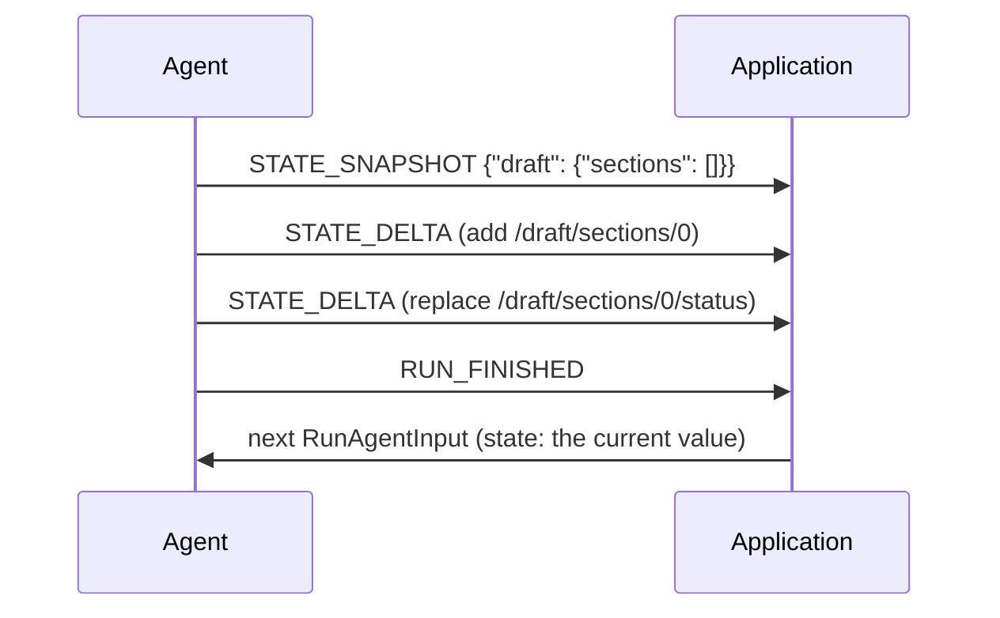

State is the value an agent and an application keep in sync — a plan, a form, a
document under construction. It travels by the
[snapshot–delta pattern](/spec/1.0/basic/patterns/snapshots); this page adds
what is specific to state and to the conversation's own snapshot.

## Events

### `STATE_SNAPSHOT`

Replaces the agent state wholesale. Sent when a delta cannot express the
change, or to resynchronise a consumer. A consumer MUST replace its state with
`snapshot` — no merging.

### `STATE_DELTA`

Amends the current state with an RFC 6902 patch. The baseline is the
consumer's current state: at the start of a run, the input's `state`; after
that, whatever the run's own snapshots and deltas have made of it. Everything
the [pattern](/spec/1.0/basic/patterns/snapshots) says about patches —
atomic application, open operations, failure handling, resynchronisation —
applies unchanged.

### `MESSAGES_SNAPSHOT`

The complete set of messages the producer owns, in order.

It is conversation-wide rather than a plain overwrite, because a consumer may
hold messages of its own that no producer tracks. Reconciliation:

- A message in the snapshot replaces the consumer's copy with the same id —
  *in place*: the consumer keeps its existing position for a message it
  already holds. A snapshot message the consumer has never seen is appended,
  in snapshot order. The snapshot's order is therefore authoritative only for
  messages the consumer meets for the first time; it does not reorder what the
  consumer already has.
- A consumer-held message *absent* from the snapshot is dropped — the producer
  is declaring the complete set — **except** client-only material the producer
  cannot know about: [activity](/spec/1.0/events/activity) messages, which
  never travel to the producer, and reasoning messages, which most producers
  do not track.
- The exception is per-role and self-revoking: a snapshot that itself carries
  any activity message is declaring the complete activity set, and the
  consumer's activity messages not in it are dropped like anything else. The
  same rule holds for reasoning messages.

Being conversation-wide, the snapshot carries no `subagentRunId` of its own;
it establishes each message's ownership through the messages it contains.

## Cross-run behaviour

State persists across runs on a thread until an event replaces it, and the
next run's input carries it back as the starting value — the loop that keeps
both sides agreed. Messages accumulate the same way;
`MESSAGES_SNAPSHOT` is the producer's way of restating that accumulation
outright.

## Message Flow

## Data Types

[`StateSnapshotEvent`](/spec/1.0/schema#statesnapshotevent), [`StateDeltaEvent`](/spec/1.0/schema#statedeltaevent) and [`MessagesSnapshotEvent`](/spec/1.0/schema#messagessnapshotevent) are defined
by the [schema reference](/spec/1.0/schema), with [`State`](/spec/1.0/schema#state) deliberately
unconstrained — any JSON value, not only an object — and deltas as
[`JsonPatch`](/spec/1.0/schema#jsonpatch).

## Error Handling

A structurally malformed patch is fatal; a well-formed patch that fails to
apply is warned about and skipped, per the
[pattern](/spec/1.0/basic/patterns/snapshots#when-a-patch-does-not-apply).

## Security Considerations

State events are remote writes into application state. An application MUST
validate what it reads out of state before acting on it — rendering it,
executing it, granting anything because of it — exactly as it would validate
any other input that crossed a trust boundary. A producer, in turn, SHOULD NOT
put secrets in state: it round-trips through the consumer and back on every
run.
