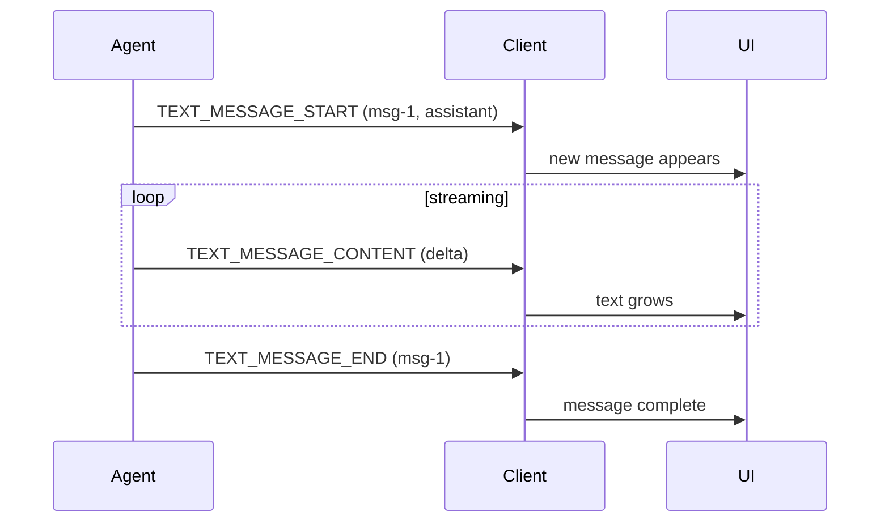

Text messages are the conversation itself: the words a user reads. A producer
streams each message as it is generated, so a UI can render text as it arrives
rather than waiting for the message to finish.

## User Interaction Model

Text messages are typically rendered as a chat transcript, each message
appearing incrementally as its content streams. The protocol does not mandate
any particular presentation — a consumer MAY buffer a whole message before
showing it, or render token by token.

## Events

Text messages follow the [streaming pattern](/spec/1.0/basic/patterns/streaming),
matched by `messageId`. The pattern's rules — open before content, close before
the run finishes, no reopening an open id — apply as written there.

### `TEXT_MESSAGE_START`

Opens a message.

```json
{
  "type": "TEXT_MESSAGE_START",
  "messageId": "msg-1",
  "role": "assistant"
}
```

- `role` is OPTIONAL; an absent role means `assistant`. The values a role may
  take are the [schema](/spec/1.0/schema#textmessagerole)'s business.
- `name` is OPTIONAL and labels the speaker within the role, for producers that
  distinguish several.

### `TEXT_MESSAGE_CONTENT`

Extends the open message. `delta` carries the next piece of the message's text;
deltas concatenate in arrival order.

```json
{
  "type": "TEXT_MESSAGE_CONTENT",
  "messageId": "msg-1",
  "delta": "Hello, world."
}
```

### `TEXT_MESSAGE_END`

Closes the message. A closed message is closed, not sealed: a producer MAY
reopen the same `messageId` with a new `TEXT_MESSAGE_START`, and the message
continues, its further content appending to what was already there. A
reopening `TEXT_MESSAGE_START` MUST agree with the message it reopens — the
same owner, the same `role`, the same `name`; the message's established values
stand, and a consumer is not required to detect the disagreement. A later
[`MESSAGES_SNAPSHOT`](/spec/1.0/events/state) MAY also restate the message
wholesale. What no event can do is change a closed message's content by any
other means.

<Note>
  Within a run, a reopening under a different owner is the attribution
  mismatch the [subagent rules](/spec/1.0/events/subagents) already reject.
  Across runs the consumer's ownership tracking has reset, which is why
  detection of a cross-run mismatch is not required — the producer's
  obligation is the same either way.
</Note>

### `TEXT_MESSAGE_CHUNK`

The compact spelling. A consumer MUST expand chunks into the three events above
as the [streaming pattern](/spec/1.0/basic/patterns/streaming#the-chunked-form)
specifies, including the first-chunk requirements and the conflicting-repeat
rule.

## Message Flow



## Data Types

The event shapes are defined by the [schema reference](/spec/1.0/schema):
[`TextMessageStartEvent`](/spec/1.0/schema#textmessagestartevent), [`TextMessageContentEvent`](/spec/1.0/schema#textmessagecontentevent), [`TextMessageEndEvent`](/spec/1.0/schema#textmessageendevent),
[`TextMessageChunkEvent`](/spec/1.0/schema#textmessagechunkevent). The assembled message appears in conversation history
as an [`AssistantMessage`](/spec/1.0/schema#assistantmessage), [`UserMessage`](/spec/1.0/schema#usermessage), [`SystemMessage`](/spec/1.0/schema#systemmessage) or [`DeveloperMessage`](/spec/1.0/schema#developermessage)
according to its role.

Metadata on any of a message's events merges into the message under the
[metadata rules](/spec/1.0/basic/metadata): key by key, last write
winning.

## Error Handling

A `TEXT_MESSAGE_CONTENT` or `TEXT_MESSAGE_END` for a `messageId` that is not
open, or a `TEXT_MESSAGE_START` for one that is, is a malformed sequence and
fatal to the run. A message left open when the run finishes is likewise a
violation. These are the [streaming pattern](/spec/1.0/basic/patterns/streaming)'s
rules; nothing about text messages softens them.
