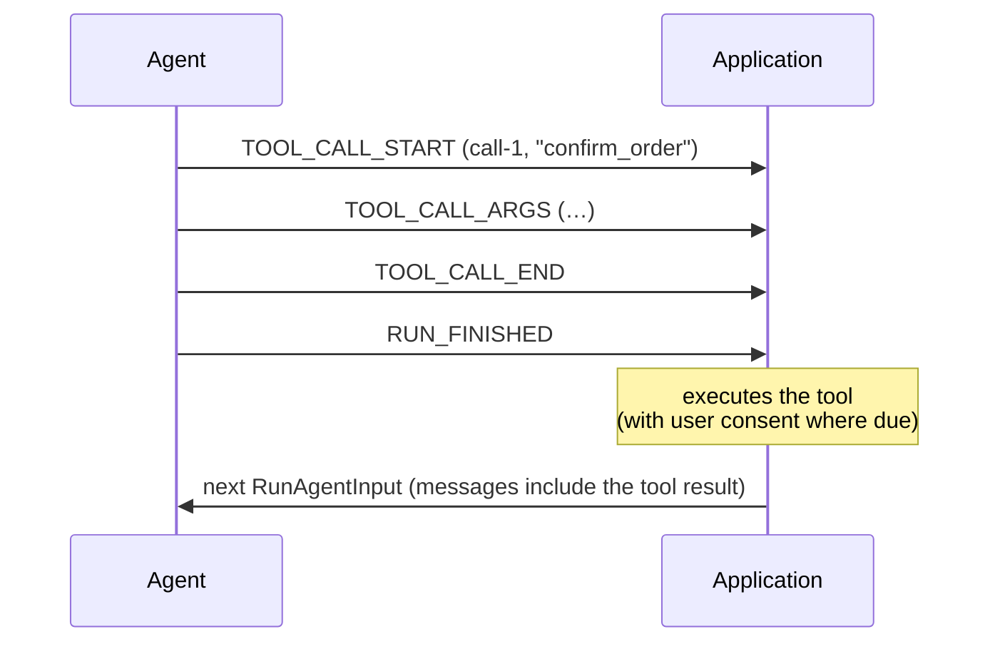

A tool call is the agent asking for something to be done. When the tool is one
the application advertised in its [run input](/spec/1.0/basic/run-input), the
application executes it — which makes tool calls the protocol's
human-in-the-loop core: the agent proposes, the application disposes.

## User Interaction Model

Applications typically surface a tool call as it streams — a card naming the
tool, arguments filling in — and, for side-effectful tools, ask the user before
executing. The protocol does not mandate any particular interaction model, but
see [Security Considerations](#security-considerations) below.

## Events

Tool calls follow the [streaming pattern](/spec/1.0/basic/patterns/streaming),
matched by `toolCallId`.

### `TOOL_CALL_START`

Opens a call.

```json
{
  "type": "TOOL_CALL_START",
  "toolCallId": "call-1",
  "toolCallName": "search",
  "parentMessageId": "msg-1"
}
```

- `toolCallName` names the tool being called.
- `parentMessageId` is OPTIONAL and attaches the call to the assistant message
  that carries it. When the parent message is attributed to a subagent, the
  call MUST agree with that attribution — a tool call belongs to the message
  that carries it (see [Subagents](/spec/1.0/events/subagents)).

### `TOOL_CALL_ARGS`

Extends the open call. `delta` carries the next piece of the call's arguments;
the concatenated deltas form the call's argument text, conventionally a JSON
document — but the protocol carries it as text and does not validate it, which
is deliberate: providers emit malformed argument strings, and the application
deciding what to do with one beats the transport killing the run.

A consumer MUST NOT act on the arguments before `TOOL_CALL_END`: until the call
closes, the text is a prefix of whatever the producer is sending, not the
thing itself.

### `TOOL_CALL_END`

Closes the call. The argument text is complete — closing establishes
completeness, not validity. Whoever executes the tool parses it, and what to
do with text that does not parse is the application's decision, not a
protocol violation.

A closed call, like a closed message, MAY be reopened by a new
`TOOL_CALL_START` with the same `toolCallId`, and further arguments append. A
reopening start MUST agree with the call it reopens — the same
`toolCallName`, the same `parentMessageId`, the same owner. A consumer is not
required to detect a disagreement, and unlike a
[reopened text message](/spec/1.0/events/text-messages#text_message_end),
the protocol makes no promise about which of the two values a consumer that
missed the violation ends up holding.

### `TOOL_CALL_CHUNK`

The compact spelling. A consumer MUST expand chunks as the
[streaming pattern](/spec/1.0/basic/patterns/streaming#the-chunked-form)
specifies: the first chunk MUST carry `toolCallId` and `toolCallName`, and a
continuation repeating `toolCallName` or `parentMessageId` with a conflicting
value is fatal.

### `TOOL_CALL_RESULT`

Carries the result of a call. It is a message in its own right — a tool message
with its own `messageId` — and does not reopen the call it answers.

```json
{
  "type": "TOOL_CALL_RESULT",
  "messageId": "msg-2",
  "toolCallId": "call-1",
  "content": "3 results found."
}
```

A result MAY arrive in the same run as its call — an agent-executed tool — or
never arrive in the stream at all: a client-executed tool's result returns to
the producer as a tool message in the next run's input instead.

#### Result content

`content` MUST be either a string or an ordered list of
[`ContentPart`](/spec/1.0/schema#contentpart)s — the same parts a
[user message](/spec/1.0/basic/run-input#messages) carries: `text`, `image`,
`audio`, `video` and `document`, each media part with a `source` that is inline
data, a URL or a
[provider file handle](/spec/1.0/basic/run-input#provider-file-handles). The
tool message the event mints has the identical shape, so a result travels into
the next run's `messages` unchanged.

```json
{
  "type": "TOOL_CALL_RESULT",
  "messageId": "msg-2",
  "toolCallId": "call-1",
  "content": [
    { "type": "text", "text": "Invoice INV-2291 attached." },
    {
      "type": "document",
      "source": { "type": "url", "value": "https://example.com/INV-2291.pdf", "mimeType": "application/pdf" },
      "metadata": { "title": "INV-2291" }
    }
  ]
}
```

- A tool returning structured data — a JSON object, say — serialises it into
  the string form or into a `text` part. The protocol has no JSON part: every
  provider accepts a tool result as text, and a typed object would have to
  become text at the provider boundary anyway.
- Anything a part does not model — a search hit's source and title, a
  document's filename — rides in the part's `metadata`. The protocol does not
  define provider-specific result blocks (a citation-enabled search result, a
  browser state); a producer that needs one maps it onto these parts or
  carries it as passthrough.
- A tool that uploaded its output to the model provider — a generated report
  now sitting in the provider's file store — returns the handle as a `file`
  source rather than re-sending the bytes; the
  [same rules](/spec/1.0/basic/run-input#provider-file-handles) apply as on
  input, and a consumer that renders the result treats the handle as opaque.
- A producer handed a part its model cannot take — an image to a text-only
  model, audio to a provider that accepts none in a tool result, a file handle
  another provider issued — MUST NOT fail
  the run because of it. It drops the part and continues, as the
  [run input rules](/spec/1.0/basic/run-input#messages) already say of user
  content, and it MUST still answer the call: a result whose every part was
  dropped is answered with the empty string, because a tool call left
  unanswered is one most models reject outright.
- A consumer that can only hold a string — a renderer, a store, a legacy
  bridge — renders a list of parts as its `text` parts concatenated in order
  and ignores the rest. Doing so is lossy and SHOULD be announced, the way any
  downgrade is ([Versioning](/spec/1.0/basic/versioning)).
- A peer from before content parts existed sends no `protocolVersion`; a
  producer that knows it is talking to one MAY flatten a result the same way
  before emitting it, and MUST warn when the flattening dropped a part. It
  MUST NOT put a placeholder in the dropped part's place: a downgrade
  reshapes, it does not invent.

## Frontend tools

The `tools` list in [run input](/spec/1.0/basic/run-input#tools) is the
application's: the agent proposes a call, the application executes it. The
protocol has no mid-run channel from the consumer, so the answer can only
cross a run boundary — which gives the round-trip its shape:

- A producer that calls a frontend tool MUST NOT answer it: no
  `TOOL_CALL_RESULT`, no fabricated tool message. The result is the
  application's to produce.
- The producer finishes the run with the call unanswered. It MUST use the
  success outcome, or none, and MUST NOT report the run as interrupted — and
  it SHOULD finish promptly once nothing remains that does not depend on the
  result. Several frontend calls MAY be left unanswered by one run; the
  application answers them all at once.
- The success outcome's `pendingToolCallIds` names the calls left unanswered,
  in the order they were made. A producer SHOULD send it when a run leaves
  calls pending; when it does, the list MUST contain exactly the tool calls
  the run started and did not answer with `TOOL_CALL_RESULT`. `RUN_FINISHED`
  alone does not say whether a run left work for the application: when the
  list is absent or empty, a consumer that needs to know derives it from the
  stream — every tool call the run started that received no result — and
  MUST NOT read absence as "nothing pending". On an interrupted run the
  pending calls are derived the same way; the interrupt outcome does not
  carry them.
- After the run finishes, the application disposes of each unanswered
  frontend call — executing it, or declining it, with whatever consent its
  own rules require. A thread that continues MUST answer every one of them
  first: the next
  run's `messages` carry a tool message per call, keyed by `toolCallId` — a
  failure is still an answer, as a tool message with `error` set, and a call
  the user declined is answered by saying so. The tool message's `content` is a
  string or a list of parts, exactly as on
  [`TOOL_CALL_RESULT`](#result-content): a frontend tool that produced a
  screenshot or picked a file answers with a media part rather than a
  description of one. An unanswered call leaves the
  agent mid-thought, and a history with a dangling call is one many models
  reject outright. Abandoning the thread answers nothing and violates
  nothing — the rule binds continuation, the same way resume coverage does.

This is a different round-trip from
[interrupts](/spec/1.0/basic/patterns/interrupt-resume): an interrupt is the
producer explicitly stopping to ask, answered by resume entries; a frontend
tool call rides the ordinary message loop, answered by conversation history.

<Note>
  A run that stops on a frontend tool call is a completed run, not an
  interrupted one, and it is not a third kind of ending either. The outcome
  reports what the producer knows about why the run ended, and here the
  producer does not know whether it is waiting: a frontend tool is often a
  terminal effect — render a chart, navigate, highlight — and whether its
  result starts another run is the application's decision, made by the
  application's rules for that tool. So the producer says what it does know —
  the run is complete, and these calls are unanswered — as detail on the
  success outcome, where an older consumer that strips the field still reads a
  successful run and derives the pending calls as it always has.
</Note>

A producer SHOULD call frontend tools only from the advertised list; a call
naming a tool the input did not advertise is not by itself a protocol
violation — what to do with it is the consumer's decision. The producer's own
tools, executed agent-side, never needed advertising and answer in-stream via
`TOOL_CALL_RESULT`.

## Message Flow

A client-executed tool spans two runs:



## Data Types

The event shapes are defined by the [schema reference](/spec/1.0/schema):
[`ToolCallStartEvent`](/spec/1.0/schema#toolcallstartevent), [`ToolCallArgsEvent`](/spec/1.0/schema#toolcallargsevent), [`ToolCallEndEvent`](/spec/1.0/schema#toolcallendevent),
[`ToolCallChunkEvent`](/spec/1.0/schema#toolcallchunkevent), [`ToolCallResultEvent`](/spec/1.0/schema#toolcallresultevent). In conversation history a call
appears as a [`ToolCall`](/spec/1.0/schema#toolcall) on an [`AssistantMessage`](/spec/1.0/schema#assistantmessage), and a result as a
[`ToolMessage`](/spec/1.0/schema#toolmessage) whose content is a string or a list of
[`ContentPart`](/spec/1.0/schema#contentpart)s. The advertised tools are [`Tool`](/spec/1.0/schema#tool) objects on [`RunAgentInput`](/spec/1.0/schema#runagentinput).

The parts are named by what they are — `TextPart`, `ImagePart` — rather than by
the direction they travel, because the same part goes into the model inside a
user message and comes out of the stream inside a tool result. The names
`ReasoningPart`, `ToolCallPart` and `AssistantPart` are reserved for a later
minor version, when assistant messages carry parts too; nothing defines them
yet, and a producer MUST NOT emit them.

## Error Handling

The [streaming pattern](/spec/1.0/basic/patterns/streaming)'s sequence rules
apply unchanged: continuing or closing a call that is not open, or reopening one
that is, is fatal. A call left open when the run finishes is a violation.

## Security Considerations

Tool calls are the protocol's largest attack surface, because they turn model
output into actions.

- Arguments are model-generated and MUST be treated as untrusted input:
  validated against the tool's declared parameter schema where one was
  advertised, scrutinised like any untrusted payload where none was, and
  never interpolated into shell commands, queries or markup unescaped.
- Applications SHOULD obtain user consent before executing a side-effectful
  tool call, and MUST NOT represent a call as user-approved when it was not.
- Tool results are data from wherever the tool got them. A consumer MUST NOT
  treat text inside a result as protocol material or as instructions carrying
  the user's authority.
- A call naming a tool that was not advertised SHOULD NOT be executed without
  the same scrutiny a new tool would get.
